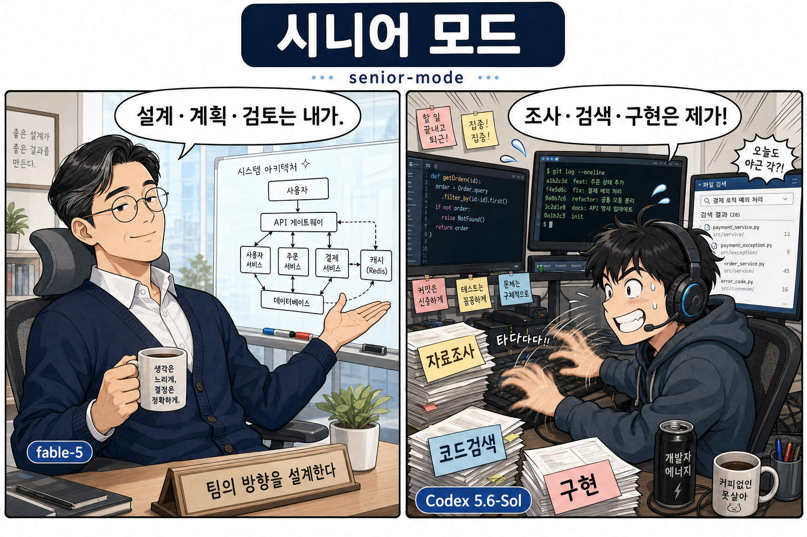

# senior-mode

*비싼 모델은 시니어 판단에만 쓰고 손이 많이 가는 조사는 Codex에 맡기는 Claude Code 스킬.*

<p align="center">
  
</p>

[English README](./README.en.md)

---

senior-mode를 켜면 Claude가 타이피스트가 아니라 시니어 엔지니어 리드처럼 움직입니다. 추론 비용이 큰 모델(fable-5)은 시니어만 해야 하는 일에만 씁니다. 무엇을 조사할지 정하고 정교한 위임 프롬프트를 쓰고 보고서를 읽고 트레이드오프를 판단하고 문서를 남기는 일이죠. 저장소를 읽고 근거를 모으고 리뷰와 디버깅을 돌리고 명시적으로 맡긴 구현을 처리하는 손품은 번들된 컴패니언 스크립트를 거쳐 Codex CLI가 맡습니다.

방식은 `openai/codex-plugin-cc`를 따릅니다. Claude는 `codex`를 직접 호출하지 않습니다. 모든 Codex 호출은 `scripts/codex-companion.mjs`를 거칩니다. 이 스크립트가 작업을 포그라운드나 백그라운드로 돌리고 상태를 디스크에 기록하고 기다리거나 지켜보거나 결과를 가져오거나 취소할 수 있게 해 줍니다.

## 언제 쓰나

빠르게 치는 것보다 시니어 판단이 더 값질 때 senior-mode를 부르세요.

- 멀티파일, 아키텍처, 마이그레이션, 디버깅처럼 섣불리 코딩하면 헛수고가 되는 문제.
- 트레이드오프 분석이나 잘 짜인 Codex 프롬프트가 필요한 결정.
- 트리거: `senior-mode`, `시니어 모드`, `fable-5로 판단`, `코덱스에게 조사 시켜`, `정교한 프롬프트 작성`.

작은 작업, 단일 파일 수정, 뻔한 버그픽스, Claude가 그냥 코드를 쓰면 되는 일에는 쓰지 마세요.

## 준비물

- **Claude Code** (CLI, 데스크톱, IDE 확장 무엇이든).
- **Node.js 18 이상** — 컴패니언 스크립트는 의존성 없는 ESM입니다.
- **[Codex CLI](https://github.com/openai/codex)** — senior-mode가 조사와 리뷰를 여기에 위임합니다.
- **git** — 설치 스크립트가 씁니다.

## 설치

한 줄이면 됩니다.

```bash
curl -fsSL https://raw.githubusercontent.com/NewTurn2017/fable-senior-mode/main/install.sh | bash
```

스킬을 `~/.claude/skills/senior-mode`에 클론합니다. 같은 명령을 다시 실행하면 최신 버전으로 갱신됩니다. 스킬 경로가 다르면 `CLAUDE_SKILLS_DIR`를 먼저 지정하세요.

### 수동 설치

```bash
git clone https://github.com/NewTurn2017/fable-senior-mode.git ~/.claude/skills/senior-mode
chmod +x ~/.claude/skills/senior-mode/scripts/codex-companion.mjs
```

## Codex 설정

senior-mode는 `codex` 바이너리를 호출하므로, Codex를 먼저 설치하고 로그인해 둬야 합니다.

1. Codex CLI를 설치합니다 ([Codex 저장소](https://github.com/openai/codex) 참고).
2. 인증합니다. Codex 문서대로 ChatGPT/OpenAI 계정으로 로그인하거나 `OPENAI_API_KEY`를 내보내면 됩니다.
3. 이 스킬에서 준비 상태를 확인합니다.

   ```bash
   node ~/.claude/skills/senior-mode/scripts/codex-companion.mjs setup
   ```

   doctor 점검을 돌려 Codex가 닿는지 알려 줍니다. 설치 스크립트가 마지막 단계에서 대신 실행해 줍니다.

## 사용법

Claude Code에서 "senior-mode", "시니어 모드"라고 부르거나, 결정 전에 위임 조사가 필요한 작업을 설명하면 됩니다. 그러면 Claude가 컴패니언 스크립트를 알아서 몰아 줍니다. 스크립트를 직접 돌릴 수도 있습니다.

```bash
# 준비 상태 확인
node scripts/codex-companion.mjs setup

# 범위가 정해진 조사 — 보고서가 올 때까지 대기
node scripts/codex-companion.mjs task --wait --read-only --prompt-file <prompt-file> --cwd <repo>

# 열린 작업 — 백그라운드로 시작한 뒤 추적
node scripts/codex-companion.mjs task --background --read-only --prompt-file <prompt-file> --cwd <repo>

# 명시적으로 맡기는 구현 (정말 그럴 때만)
node scripts/codex-companion.mjs task --write --prompt-file <prompt-file> --cwd <repo>

# 베이스 브랜치 대비 코드 리뷰
node scripts/codex-companion.mjs review --background --base main --cwd <repo>
```

### 백그라운드 작업 추적

백그라운드 작업은 매번 job id를 돌려줍니다. 같은 작업을 다시 띄우지 말고 이 id를 쓰세요.

| 명령 | 하는 일 |
| --- | --- |
| `status <job-id> --cwd <repo>` | 작업의 현재 상태(또는 최근 작업 목록). |
| `wait <job-id> --cwd <repo>` | 끝날 때까지 기다린 뒤 결과 출력. |
| `watch <job-id> --cwd <repo>` | 변경마다 JSON 상태 한 줄, 마지막에 `done` 또는 `timeout`. |
| `result <job-id> --cwd <repo>` | 저장된 결과 출력 (id를 빼면 가장 최근 작업). |
| `cancel <job-id> --cwd <repo>` | 실행 중인 작업과 Codex 프로세스를 멈춤. |

쓸 만한 플래그: `--prompt-file`(셸 따옴표에 안 깨지는 여러 줄 프롬프트), `--timeout-ms`, `--poll-interval-ms`, `--model`, `--effort`, `--json`, `--state-dir`.

`--model`은 지정하지 않으면 Codex 쪽 기본 모델(현재 `gpt-5.6-sol`)을 그대로 씁니다. 짧은 별칭 `sol`(= `gpt-5.6-sol`)·`luna`(= `gpt-5.6-luna`)·`spark`(= `gpt-5.3-codex-spark`)를 쓸 수 있고, `--effort`는 `none`부터 `xhigh`·`max`·`ultra`까지 받습니다.

작업 상태는 워크스페이스 루트의 `.senior-mode/codex/jobs/` 아래에 기록되고 gitignore됩니다.

## LazyCodex (선택)

[LazyCodex](https://www.npmjs.com/package/lazycodex-ai)는 프로젝트 메모리, 플래닝, 서브에이전트, 훅, 검증 완료 루프를 더해 주는 선택형 Codex 측 하니스입니다. senior-mode는 이게 없어도 돌아갑니다. 맡긴 작업이 충분히 넓어서 Codex가 플랜·실행·검증 루프를 직접 들고 가야 할 때만 쓰세요. `~/.codex` 설정을 건드리므로 설치는 의도적으로 하세요.

```bash
npx lazycodex-ai install --no-tui --codex-autonomous   # 원할 때만
npx lazycodex-ai doctor                                 # 상태 점검
```

LazyCodex를 쓰기로 하면 Claude가 트리거 하나를 골라 위임을 라우팅합니다. 이 라우팅 판단 자체가 시니어의 일입니다.

| 상황 | 트리거 |
| --- | --- |
| 범위가 확정된 멀티파일 구현, 판단 여지 적음 | `ulw` (write task 한 방) |
| 크거나 모호한 작업 — 상세 플랜부터 필요 | `$ulw-plan` (read-only, 플랜만) |
| Claude가 검토하고 사용자가 승인한 플랜 실행 | `$start-work` (플랜 경로 지정 write task) |
| 장기 멀티골 작업, 증거 게이트 필요 | `$ulw-loop` (백그라운드 write task) |
| 범위를 한정할 수 없는 전방위 리서치 (코드베이스+웹+공식문서) | `$ulw-research` (백그라운드 read-only task) |

Claude는 설계 브리프(트리거 줄, 목표, 검증 가능한 성공 기준, Must-NOT 범위, 완료 마커)까지만 씁니다. 상세 태스크 분해는 저장소를 직접 탐색하는 OmO 플래너의 몫입니다. 큰 작업은 2단계로 갑니다: `$ulw-plan`이 `.omo/plans/<slug>.md`를 만들고, Claude가 시니어 관점으로 검토하고, 사용자가 승인하면 `$start-work`로 실행. 프롬프트 파일 첫 줄에 트리거를 단독으로 넣고 평소대로 `task`를 돌리면 됩니다. 완료 추적은 계속 `wait` / `watch` / `status` / `result`로 하세요.

## 위임 경로 3가지

기본 위임처는 Codex지만, 명시적으로 요청하면 Anthropic 모델로도 위임합니다. 어느 경로든 시니어 계약(역할 경계·위임 프롬프트·보고서 처리)은 동일하고, Claude가 임의로 위임처를 바꾸지 않습니다.

| 진입점 | 위임처 | 런타임 |
| --- | --- | --- |
| `/senior-mode` (기본) | Codex | 컴패니언 스크립트 |
| `/senior-mode:codex` | Codex 고정 | 컴패니언 스크립트 (세션 내내 고정) |
| `/senior-mode:luna` | Codex `gpt-5.6-luna` + `max` effort 고정 | 컴패니언 스크립트 (모델·effort까지 세션 내내 고정) |
| "opus로 구현해줘" | Opus 5 단일 에이전트 | Claude Code 내장 Agent 툴 (`model: "opus"`) |
| `/senior-mode:team` | Anthropic 에이전트 팀 | 세션 메인 모델(fable-5 또는 Opus 5)이 팀 리드 |

**Opus 단일 에이전트** — 조사는 읽기 전용 Explore 에이전트, 구현은 general-purpose 에이전트(위험한 멀티파일 변경은 워크트리 격리)로 매핑됩니다. 별도 설치나 설정이 필요 없습니다.

**에이전트 팀 모드** — [Claude Code 공식 agent teams](https://code.claude.com/docs/en/agent-teams) 기반으로, `/model`에서 고른 메인 모델이 팀 리드(시니어)가 되어 Claude 팀메이트들에게 조사·리뷰·구현을 병렬 위임합니다. 팀메이트 기본 모델은 Opus, 리드는 코드를 쓰지 않고 스폰 프롬프트·플랜 승인·종합 판단만 담당합니다. 실험 기능이라 `~/.claude/settings.json`에 `"env": {"CLAUDE_CODE_EXPERIMENTAL_AGENT_TEAMS": "1"}`를 넣고 세션을 재시작해야 하며, 꺼져 있으면 백그라운드 서브에이전트로 대체 실행을 제안합니다. 세부 계약은 `references/team-runtime.md`에 있습니다.

## 제거

```bash
rm -rf ~/.claude/skills/senior-mode
rm ~/.claude/commands/senior-mode
```

## 저장소 구성

```
senior-mode/
├─ SKILL.md                    # Claude Code가 읽는 스킬 정의 (위임 경로 라우팅 포함)
├─ references/
│  └─ team-runtime.md          # /senior-mode:team 에이전트 팀 런타임 계약
├─ commands/
│  ├─ team.md                  # /senior-mode:team 슬래시 커맨드
│  ├─ codex.md                 # /senior-mode:codex 슬래시 커맨드
│  └─ luna.md                  # /senior-mode:luna 슬래시 커맨드 (gpt-5.6-luna, max effort)
├─ scripts/
│  └─ codex-companion.mjs      # 의존성 없는 Codex 런타임 경계
├─ docs/
│  └─ senior-mode-webtoon.png  # README 상단 히어로 이미지
├─ install.sh                  # curl로 바로 실행하는 설치 스크립트
├─ README.md                   # 이 파일 (한국어)
└─ README.en.md                # 영문 README
```

설치 스크립트가 `commands/`를 `~/.claude/commands/senior-mode`로 심링크해 두 슬래시 커맨드를 등록합니다.

## 라이선스

[MIT](./LICENSE)
